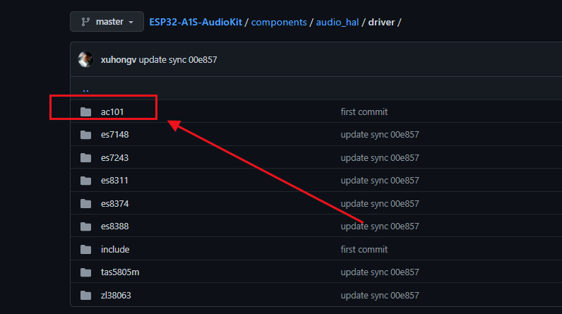
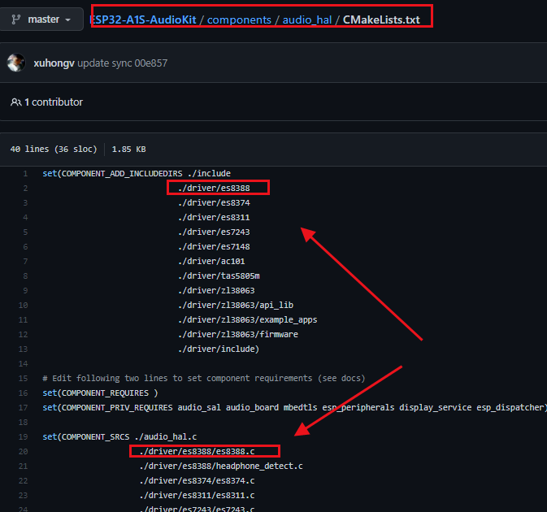

# Ai-Thinker AudioKit Board SDK


EN | [中文](./README-zh.md)

This framework is based on the second development of the ESPRESSIF audio framework esp-adf and follows the official open source agreement.

- https://github.com/Ai-Thinker-Open/ESP32-A1S-AudioKit

## Overview

The framework is also suitable for the company's official development board such as esp-lyart, which also easily adds functions in the most comprehensive way, from simple to complex development of audio applications

- Music player or recorder supports audio formats such as MP3, AAC, FLAC, WAV, OGG, OPUS, AMR, TS, EQ, Downmixer, Sonic, ALC, G.711...
- Play music from sources: HTTP, HLS(HTTP Live Streaming), SPIFFS, SDCARD,  A2DP-Source, A2DP-Sink, HFP ...
- Integrate Media services such as: DLNA, VoIP ...
- Internet Radio
- Voice recognition and integration with online services such as Alexa, DuerOS, ...

## Developing with the ESP-ADF

### Hardware

AI Thinker boards V2.2 974 are using A1S designs where the AC101 was replaced by the ES8388 , including:

|     ESP32-A1S-Kit ES8388 Development Board（undersides）     |     ESP32-A1S-Kit AC101 Development Board（undersides）      |
| :----------------------------------------------------------: | :----------------------------------------------------------: |
|  | [](https://docs.espressif.com/projects/esp-adf/en/latest/get-started/get-started-esp32-lyratd-msc.html) |
|                  ESP32 + ES8388 audio chip                   |                   ESP32 + AC101 audio chip                   |

### Quick Start

#### Step 1. Set up ESP-IDF for Windows, Linux or Mac OS

please refer to the [get-started-setup-esp-idf](https://docs.espressif.com/projects/esp-adf/en/latest/get-started/index.html#get-started-setup-esp-idf)

#### Step 2. Get the ESP-ADF 

```
git clone --recursive https://github.com/espressif/esp-adf.git
```

If you clone project without `--recursive` flag, please goto the `esp-adf` directory and run command `git submodule update --init` before doing anything.

#### Step 3. Set up Path to ESP-ADF 

The toolchain programs access ESP-ADF using ``ADF_PATH`` environment variable. This variable should be set up on your PC, otherwise the projects will not build.

**Windows**

Open Command Prompt and run the following command::

```
set ADF_PATH=%userprofile%\esp\esp-adf
```

You need to enter this command each time you start your PC. To avoid retyping you can add it to "ESP-IDF Command Prompt", batch or Power Shell scripts described in Step 4 below.

To make sure that ADF_PATH has been set up properly, run:

```
 echo %ADF_PATH%
```

It should return the path to your ESP-ADF directory.

**Linux and macOS**

Open Terminal, and run the following commands::

    export ADF_PATH=~/esp/esp-adf

You need to enter this command each time you open a Terminal. To make this setting permanent follow similar [instructions](https://docs.espressif.com/projects/esp-idf/en/v3.3.1/get-started/add-idf_path-to-profile.html#linux-and-macos) for configuration of ``IDF_PATH`` in ESP-IDF Programming Guide.

Check if ``ADF_PATH`` has been set up to point to directory with ESP-ADF::

    printenv ADF_PATH

#### Step 4. Set up the environment variables

Before being able to compile ESP-ADF projects, on each new session, ESP-IDF tools should be added to the PATH environment variable. To make the tools usable from the command line, some environment variables must be set. ESP-IDF provides a script which does that.

**Windows**

[ESP-IDF Tools Installer](https://docs.espressif.com/projects/esp-idf/en/latest/esp32/get-started/windows-setup.html#get-started-windows-tools-installer) for Windows creates an "ESP-IDF Command Prompt" shortcut in the Start Menu. This shortcut opens the Command Prompt and sets up all the required environment variables. You can open this shortcut and proceed to the next step.

Alternatively, if you want to use ESP-IDF in an existing Command Prompt window, you can run:

```
%userprofile%\esp\esp-idf\export.bat
```

or with Windows PowerShell

```
.$HOME/esp/esp-idf/export.ps1
```

**Linux and macOS**

In the terminal where you have installed ESP-IDF, run:

```
. $HOME/esp/esp-idf/export.sh
```

Note the space between the leading dot and the path!

You can also create an alias for the export script to your `.profile` or `.bash_profile` script. This way you can set up the environment in a new terminal window by typing `get_idf`:

```
alias get_idf='. $HOME/esp/esp-idf/export.sh'
```

Note that it is not recommended to source `export.sh` from the profile script directly. Doing so activates IDF virtual environment in every terminal session (even in those where IDF is not needed), defeating the purpose of the virtual environment and likely affecting other software.

#### Step 5. Adapter ESP-A1S Module 

##### For ESP-A1S （ESP32 + ES8388 audio chips）

- status: on sale
- audio chips: ES8388 

**step 1** : alter the gpio connection ，path： ```esp-adf/components/audio_board/lyrat_v4_3/board_pins_config.c```

- sda_io: GPIO_33
- scl_io: GPIO_32
- bck_io: GPIO_NUM_27

the code as here:

```
esp_err_t get_i2c_pins(i2c_port_t port, i2c_config_t *i2c_config)
{
    AUDIO_NULL_CHECK(TAG, i2c_config, return ESP_FAIL);
    if (port == I2C_NUM_0 || port == I2C_NUM_1) {
        i2c_config->sda_io_num = GPIO_NUM_33;
        i2c_config->scl_io_num = GPIO_NUM_32;
    } else {
        i2c_config->sda_io_num = -1;
        i2c_config->scl_io_num = -1;
        ESP_LOGE(TAG, "i2c port %d is not supported", port);
        return ESP_FAIL;
    }
    return ESP_OK;
}

esp_err_t get_i2s_pins(i2s_port_t port, i2s_pin_config_t *i2s_config)
{
    AUDIO_NULL_CHECK(TAG, i2s_config, return ESP_FAIL);
    if (port == I2S_NUM_0 || port == I2S_NUM_1) {
        i2s_config->bck_io_num = GPIO_NUM_27;
        i2s_config->ws_io_num = GPIO_NUM_25;
        i2s_config->data_out_num = GPIO_NUM_26;
        i2s_config->data_in_num = GPIO_NUM_35;
    } else {
        memset(i2s_config, -1, sizeof(i2s_pin_config_t));
        ESP_LOGE(TAG, "i2s port %d is not supported", port);
        return ESP_FAIL;
    }
    return ESP_OK;
}
```

----------------------

##### For ESP-A1S （ESP32 + AC101 audio chips）

- status：halt production
- audio chips: AC101

**step 1** :  edit the component file  to add the AI Thinker Board to ESP-ADF :   [components/audio_board/component.mk](https://github.com/espressif/esp-adf/blob/master/components/audio_board/component.mk)  

```
ifdef CONFIG_ESP_AI_THINKER_V2_2_BOARD
COMPONENT_ADD_INCLUDEDIRS += ./ai_thinker_audio_kit_v2_2
COMPONENT_SRCDIRS += ./ai_thinker_audio_kit_v2_2
endif
```

**step 2** :  add the AI Thinker Board include files to ESP-ADF , add the code form the file [ai_thinker_audio_kit_v2_2](ESP32_AC101_Driver\ai_thinker_audio_kit_v2_2):


and add the below code to edit the config file  :   [components/audio_board/CMakeLists.txt](https://github.com/espressif/esp-adf/blob/master/components/audio_board/CMakeLists.txt)  

```
if (CONFIG_ESP_AI_THINKER_V2_2_BOARD)
message(STATUS "Current board name is " CONFIG_ESP_AI_THINKER_V2_2_BOARD)
list(APPEND COMPONENT_ADD_INCLUDEDIRS ./ai_thinker_audio_kit_v2_2)
set(COMPONENT_SRCS
./ai_thinker_audio_kit_v2_2/board.c
./ai_thinker_audio_kit_v2_2/board_pins_config.c
)
endif()
```

laster , add the below code to edit the default config  :   [components/audio_board/Kconfig.projbuild](https://github.com/espressif/esp-adf/blob/master/components/audio_board/Kconfig.projbuild)  

```
choice AUDIO_BOARD
    prompt "Audio board"
    default ESP_AI_THINKER_V2_2_BOARD
    help
        Select an audio board to use with the ESP-ADF
        
···
···

config ESP_AI_THINKER_V2_2_BOARD
    bool "ESP32-AiThinker-audio V2.2"
```

**step 3** :   add the AI Thinker Board AC101 driver files to ESP-ADF , add the code form the file [ac101](ESP32_AC101_Driver\ac101):



and add the below code to edit the default config  :   [components/audio_hal/component.mk](https://github.com/espressif/esp-adf/blob/master/audio_hal/component.mk)  

```
COMPONENT_ADD_INCLUDEDIRS += ./driver/ac101
COMPONENT_SRCDIRS += ./driver/ac101
```

laster , add the below code to edit the CMake file :   [components/audio_hal/CMakeLists.txt](https://github.com/espressif/esp-adf/blob/master/audio_hal/CMakeLists.txt)  

```
 ./driver/es8388
 ./driver/es8388/es8388.c
```




#### Step 6. Start a Project 

#####  For ESP-A1S （ESP32 + ES8388 audio chips）

cd ```examples/player/pipeline_bt_source``` , run ```idf.py menuconfig --- Audio Hal``` , select ```ESP32-Lyrat V4.3```


Flash the binaries that you just built onto your board by running :

```
idf.py -p PORT [-b BAUD] flash monitor
```

##### For ESP-A1S （ESP32 + AC101 audio chips）

cd ```examples/player/pipeline_bt_source``` , run ```idf.py menuconfig --- Audio Hal``` , select ```ESP_AI_THINKER_V2_2_BOARD```

Flash the binaries that you just built onto your board by running :

```
idf.py -p PORT [-b BAUD] flash monitor
```

##### 

# Resources

* [Documentation](https://docs.espressif.com/projects/esp-adf/en/latest/index.html) for the latest version of https://docs.espressif.com/projects/esp-adf/. This documentation is built from the [docs directory](docs) of this repository.
* The [aithinker  forum](http://bbs.ai-thinker.com/forum.php) is a place to ask questions and find community resources.
* If you're interested in contributing to ESP-ADF, please check the [Contributions Guide](https://esp-idf.readthedocs.io/en/latest/contribute/index.html).
* Support Email : xuhongv@aithinker.com
* thanks: https://github.com/xuhongv
